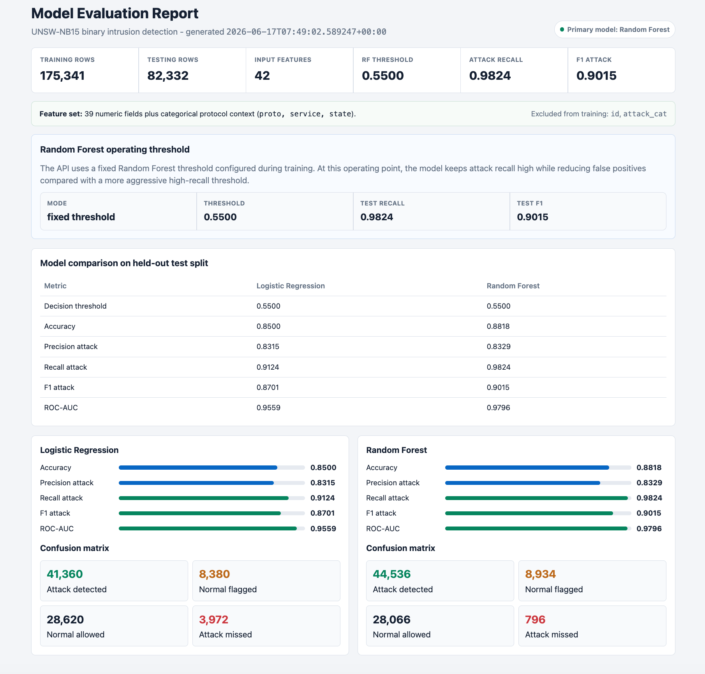
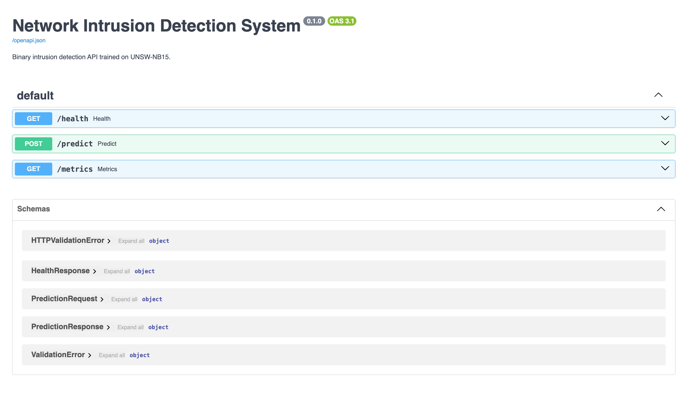
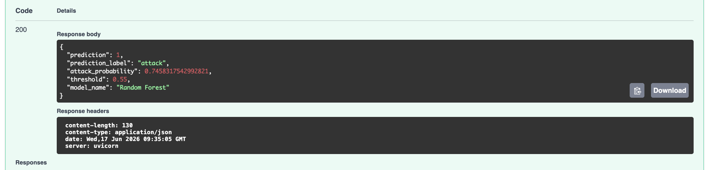
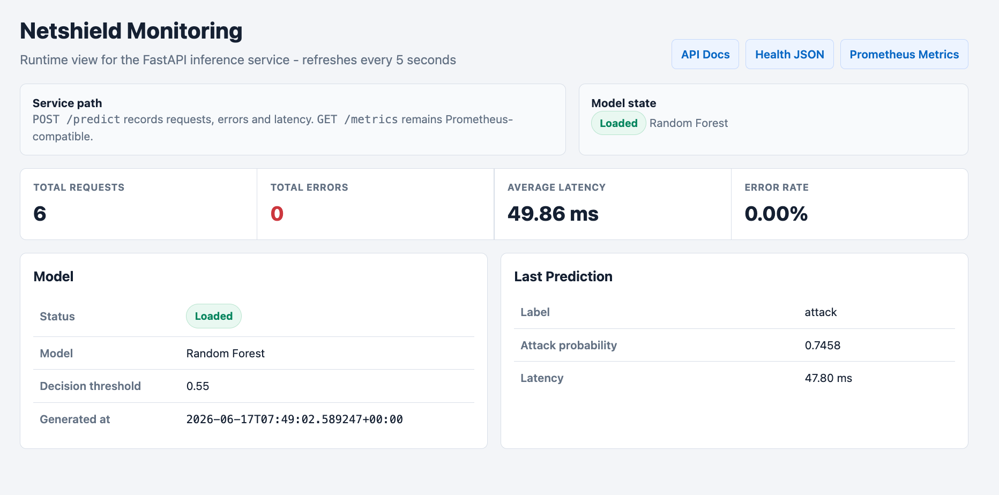

# Network Intrusion Detection System

[](https://github.com/Sukulli/Network-Anomaly-Detector/actions/workflows/ci.yml)
[](LICENSE)

End-to-end machine learning project for binary network intrusion detection on the UNSW-NB15 dataset.

The project trains classical ML classifiers, saves a reusable scikit-learn pipeline, exposes the main model through a FastAPI REST API, and provides basic Prometheus-compatible monitoring.

Deep learning is intentionally out of scope for this first version. The goal is to build a complete, reproducible, explainable, and deployable ML system before adding more complex modeling techniques.

## Scope

- Dataset: UNSW-NB15
- Task: binary classification
- Target: `label`
- Classes: `0 = normal`, `1 = attack`
- Baseline model: Logistic Regression
- Main model: Random Forest
- Serving: FastAPI
- Monitoring: Prometheus metrics plus a simple HTML monitoring page
- Containerization: Docker and Docker Compose

## Architecture

```text
UNSW-NB15 CSV files
        |
        v
Data loading and feature split
        |
        v
Preprocessing pipeline
  - numeric features passthrough/scaling depending on model
  - categorical one-hot encoding
        |
        v
Model training
  - Logistic Regression baseline
  - Random Forest main model
        |
        v
Saved scikit-learn pipeline
        |
        v
FastAPI inference service
        |
        v
/predict, /health, /metrics, /monitoring
```

## Project Structure

```text
network-anomaly-detector/
├── app/                    # FastAPI app, inference service and monitoring
├── data/                   # Local data folder, raw data is not committed
├── models/                 # Metadata is tracked, binary models are ignored
├── notebooks/              # Exploratory notebooks
├── reports/                # Dataset, training, analysis and dashboard outputs
├── src/                    # Data loading, preprocessing, training and evaluation
├── tests/                  # API tests
├── Dockerfile
├── docker-compose.yml
├── pytest.ini
├── requirements.txt
└── README.md
```

## Dataset

This project expects the official pre-split UNSW-NB15 CSV files:

```text
UNSW_NB15_training-set.csv
UNSW_NB15_testing-set.csv
```

By default, the code looks for the dataset in:

```text
../UNSW-NB15 dataset/CSV Files/Training and Testing Sets/
```

If your dataset is stored elsewhere, set:

```bash
export UNSW_NB15_DATA_DIR="/path/to/Training and Testing Sets"
```

Dataset summary used in the current run:

- Training rows: 175,341
- Testing rows: 82,332
- Input features: 42
- Numeric features: 39
- Categorical features: `proto`, `service`, `state`
- Target column: `label`
- Excluded columns: `id`, `attack_cat`

`attack_cat` is excluded from the binary model input because it directly describes the attack category and would leak target-related information into the feature set.

See [reports/dataset_overview.md](reports/dataset_overview.md).

## Dataset Citation

This project uses the UNSW-NB15 dataset. The official UNSW dataset page states that academic or public use of the dataset should cite the five papers listed by the dataset authors:

- Official dataset page: [The UNSW-NB15 Dataset](https://research.unsw.edu.au/projects/unsw-nb15-dataset)

Required UNSW-NB15 citations:

1. Moustafa, N., and Slay, J. "UNSW-NB15: a comprehensive data set for network intrusion detection systems (UNSW-NB15 network data set)." Military Communications and Information Systems Conference (MilCIS), IEEE, 2015.
2. Moustafa, N., and Slay, J. "The evaluation of Network Anomaly Detection Systems: Statistical analysis of the UNSW-NB15 dataset and the comparison with the KDD99 dataset." Information Security Journal: A Global Perspective, 2016.
3. Moustafa, N., et al. "Novel geometric area analysis technique for anomaly detection using trapezoidal area estimation on large-scale networks." IEEE Transactions on Big Data, 2017.
4. Moustafa, N., et al. "Big data analytics for intrusion detection system: statistical decision-making using finite Dirichlet mixture models." Data Analytics and Decision Support for Cybersecurity, Springer, 2017.
5. Sarhan, M., Layeghy, S., Moustafa, N., and Portmann, M. "NetFlow Datasets for Machine Learning-Based Network Intrusion Detection Systems." Big Data Technologies and Applications, Springer Nature, 2020.

## Current Results

The current model artifacts were trained with an operational decision threshold of `0.55`.

| Model | Threshold | Accuracy | Precision attack | Recall attack | F1 attack | ROC-AUC |
| --- | ---: | ---: | ---: | ---: | ---: | ---: |
| Logistic Regression | 0.55 | 0.8500 | 0.8315 | 0.9124 | 0.8701 | 0.9559 |
| Random Forest | 0.55 | 0.8818 | 0.8329 | 0.9824 | 0.9015 | 0.9796 |

Random Forest is the main model because it provides the strongest overall test-set performance in this version, especially on attack recall and F1-score.

At threshold `0.55`, the Random Forest confusion matrix on the test set is:

| Outcome | Count |
| --- | ---: |
| True negative | 28,066 |
| False positive | 8,934 |
| False negative | 796 |
| True positive | 44,536 |

This threshold is a deliberate operating point: it keeps attack recall high while reducing the number of false positives compared with a more aggressive threshold such as `0.45`.

Detailed reports:

- [reports/training_results.md](reports/training_results.md)
- [reports/training_dashboard.html](reports/training_dashboard.html)
- [reports/random_forest_analysis.md](reports/random_forest_analysis.md)
- [reports/random_forest_threshold_analysis.csv](reports/random_forest_threshold_analysis.csv)
- [reports/random_forest_feature_importance.csv](reports/random_forest_feature_importance.csv)
- [reports/random_forest_grouped_feature_importance.csv](reports/random_forest_grouped_feature_importance.csv)

## Screenshots

The screenshots below show the main evaluation report, the FastAPI documentation, a successful `/predict` request and the runtime monitoring page.

### Model Evaluation Report



### API Documentation



### Successful Prediction Request



### Monitoring Dashboard



## Random Forest Interpretation

The Random Forest analysis includes:

- threshold comparison
- error profile at the operational threshold
- transformed feature importance
- grouped feature importance for one-hot encoded categorical features

Current top grouped features include:

- `sttl`
- `ct_state_ttl`
- `sload`
- `rate`
- `dload`
- `state`
- `dpkts`
- `sbytes`
- `dttl`
- `smean`

Feature importance is useful for model inspection, but it should not be interpreted as causal evidence. It only describes how this trained Random Forest uses the available features.

## Setup

Python 3.12 is recommended.

```bash
git clone <repository-url>
cd network-anomaly-detector

python3.12 -m venv .venv
source .venv/bin/activate
pip install -r requirements.txt
```

Verify the environment:

```bash
python --version
python -c "import pandas as pd; import sklearn; print(pd.__version__, sklearn.__version__)"
```

## Training

Train both models with the current operational threshold:

```bash
python -m src.train --model both --threshold 0.55
```

This writes:

- `models/logistic_regression_model.pkl`
- `models/random_forest_model.pkl`
- `models/model.pkl`
- `models/metadata.json`
- `reports/training_results.md`
- `reports/training_results.json`

Generate the HTML training dashboard:

```bash
python -m src.visualize_results
```

Generate the Random Forest analysis:

```bash
python -m src.analyze_random_forest
```

Quick smoke training on a stratified sample:

```bash
python -m src.train --model both --sample-size 5000 --no-save --reports-dir /tmp/netshield-smoke-reports
```

Optional threshold search for Random Forest:

```bash
python -m src.train --model both --threshold 0.55 --auto-threshold
```

The final project currently uses fixed threshold `0.55`, not the automatic threshold mode.

## Run The API Locally

Make sure the model files exist first. If `models/model.pkl` is missing, run the training command.

```bash
uvicorn app.main:app --host 127.0.0.1 --port 8000
```

Open:

```text
http://127.0.0.1:8000/docs
```

Available endpoints:

| Endpoint | Method | Purpose |
| --- | --- | --- |
| `/health` | GET | Service and model status |
| `/predict` | POST | Binary prediction for one network-flow record |
| `/metrics` | GET | Prometheus-compatible raw metrics |
| `/monitoring` | GET | Human-readable monitoring dashboard |
| `/monitoring/snapshot` | GET | Monitoring state as JSON |

Health check:

```bash
curl http://127.0.0.1:8000/health
```

Prediction with the included sample request:

```bash
curl -X POST http://127.0.0.1:8000/predict \
  -H "Content-Type: application/json" \
  --data @reports/sample_prediction_request.json
```

Example response:

```json
{
  "prediction": 1,
  "prediction_label": "attack",
  "attack_probability": 0.7458317542992821,
  "threshold": 0.55,
  "model_name": "Random Forest"
}
```

## Docker

Build and run the service:

```bash
docker compose up --build
```

Then open:

```text
http://127.0.0.1:8000/docs
http://127.0.0.1:8000/health
http://127.0.0.1:8000/monitoring
```

Stop the container:

```bash
docker compose down
```

Important: model binaries are not intended to be committed to Git. If you clone the repository on a new machine, train the models before starting the API or building the Docker image.

## Tests

Run:

```bash
pytest -q
```

GitHub Actions runs the same test suite on every push and pull request to `main`.
Because trained model binaries are intentionally excluded from Git, CI runs the model-free contract tests and skips the model-dependent API tests with an explicit reason.

The current tests cover:

- `GET /health`
- valid `POST /predict`
- invalid `POST /predict` payload
- `GET /metrics`
- `GET /monitoring`
- `GET /monitoring/snapshot`
- API schema, sample request and metadata contracts
- required UNSW-NB15 dataset citation in the README

The API tests require `models/model.pkl`. If the model is missing, train the model first.

## GitHub Notes

The repository is configured to avoid committing:

- virtual environments
- Python cache files
- local raw datasets
- generated model binaries
- local OS files such as `.DS_Store`

Tracked files should include source code, tests, documentation, lightweight metadata and lightweight report artifacts.

The binary model files are intentionally ignored:

```text
models/*.pkl
```

This keeps the GitHub repository lightweight and reproducible. The model can be regenerated with:

```bash
python -m src.train --model both --threshold 0.55
```

## License

The source code and project documentation in this repository are released under the [MIT License](LICENSE).

This license applies only to this repository's original code and documentation. It does not grant rights over:

- the UNSW-NB15 dataset
- dataset files downloaded from UNSW or other mirrors
- generated model binaries such as `models/*.pkl`
- third-party dependencies listed in `requirements.txt`

The UNSW-NB15 dataset is not redistributed in this repository. Users must obtain it from the official source and follow the dataset authors' citation requirements described in [Dataset Citation](#dataset-citation).

## Limitations

This project is a portfolio-grade ML engineering prototype, not a production IDS.

Important limitations:

- It performs binary classification on preprocessed UNSW-NB15 tabular flow records, not live packet inspection.
- It does not capture real network traffic.
- It does not perform streaming inference.
- It does not include active alerting, incident response, or security orchestration.
- It does not include authentication or authorization on the API.
- It does not include rate limiting.
- It does not include model drift detection.
- It does not include continuous retraining.
- It does not validate performance on traffic from a real deployment environment.
- It does not claim generalization to modern enterprise traffic without further validation.
- The test split is the official UNSW-NB15 test CSV, so reported metrics are dataset-specific.
- Feature importance is model-specific and should not be treated as causal explanation.
- The Random Forest model can be relatively large, which is why binary artifacts are excluded from Git.

## Roadmap

Possible next improvements:

- Add cross-validation or a cleaner train-validation-test workflow.
- Add more robust hyperparameter tuning for Random Forest.
- Add LightGBM or XGBoost as an additional classical model.
- Add probability calibration.
- Add precision-recall curve visualization.
- Add drift monitoring for incoming prediction distributions.
- Add API authentication.
- Add CI that trains on a small sample for fast validation.
- Add a Grafana dashboard backed by Prometheus.
- Add multi-class attack category analysis as a separate task.
- Add deep learning only after the classical ML system is stable and well understood.

## Ethical Use

This project is intended for educational and defensive security purposes. It should not be used as the only security control in a real network environment.
